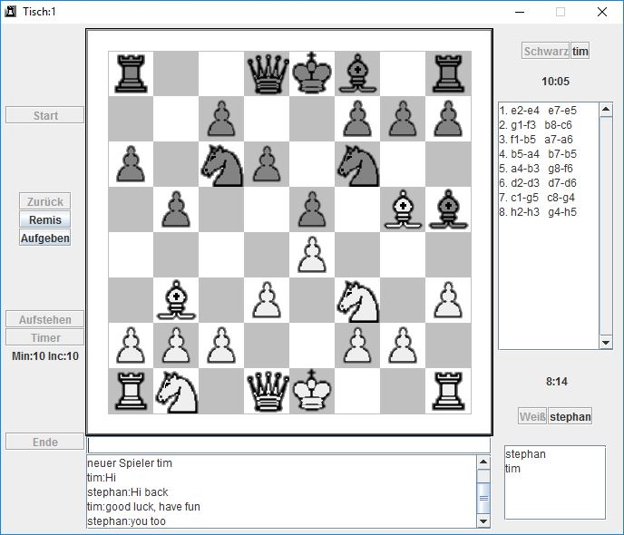

NetChess
========

A german chess server and client with chat function inspired by the chess program on yahoo.com.

### History

I wrote this program in 2001 in Java 1.3 (Generics were introduced in Java 5).
It was only my second programming project, so i hadn't learnt about unittests yet or how to structure code
(model-view-controler seperation, subpackages or that the whole server implementation is within the same java file).

### Main classes
The main class of the client is `AccessFrame`, the main class of the server is `ChessServer`.